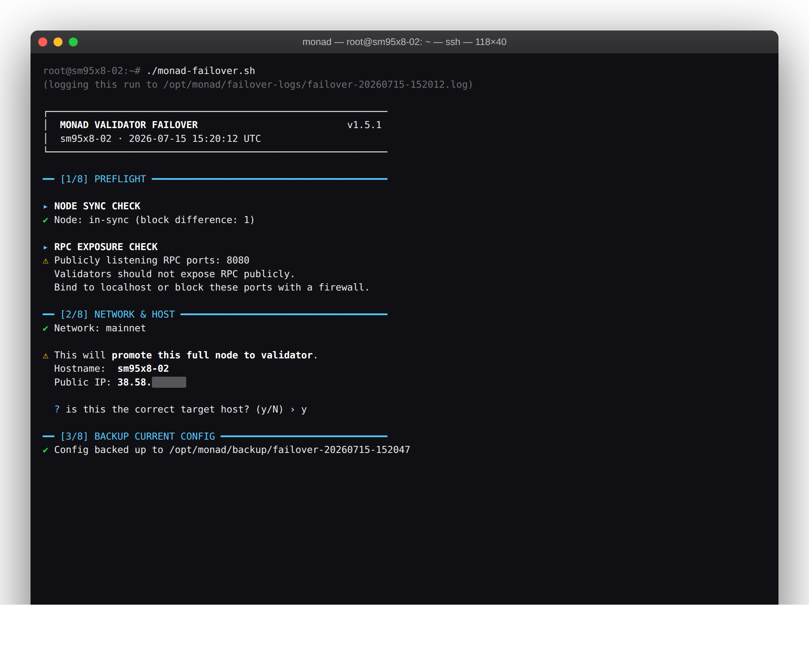
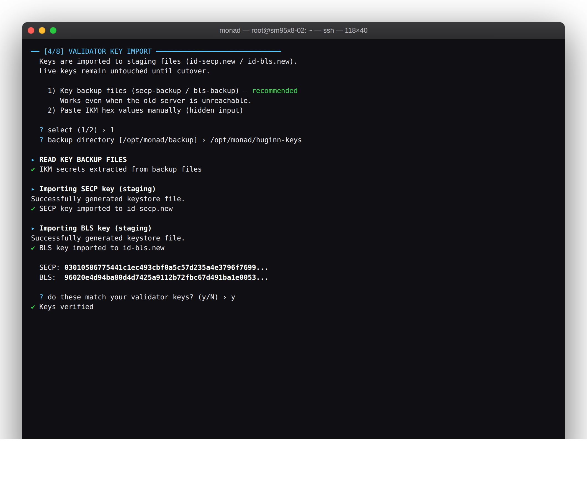
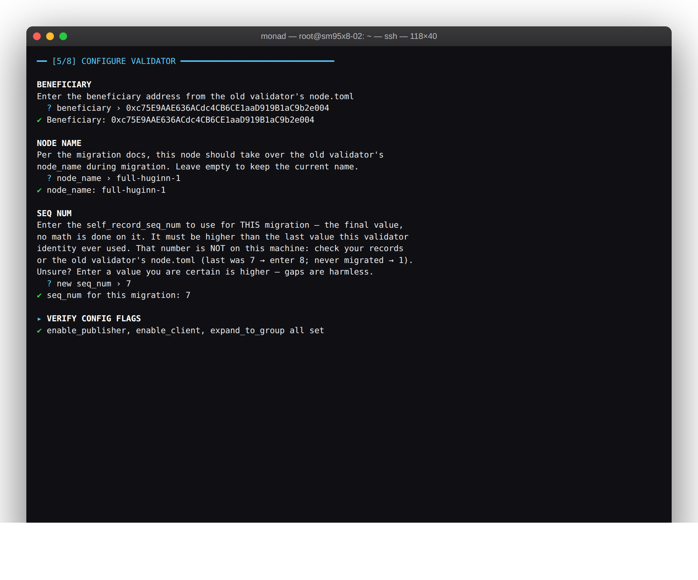
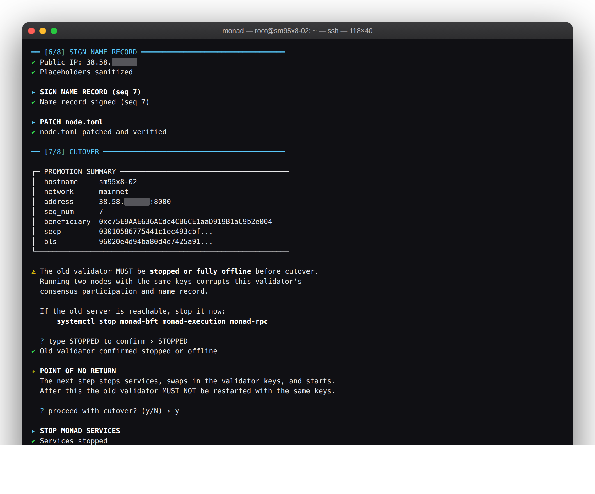
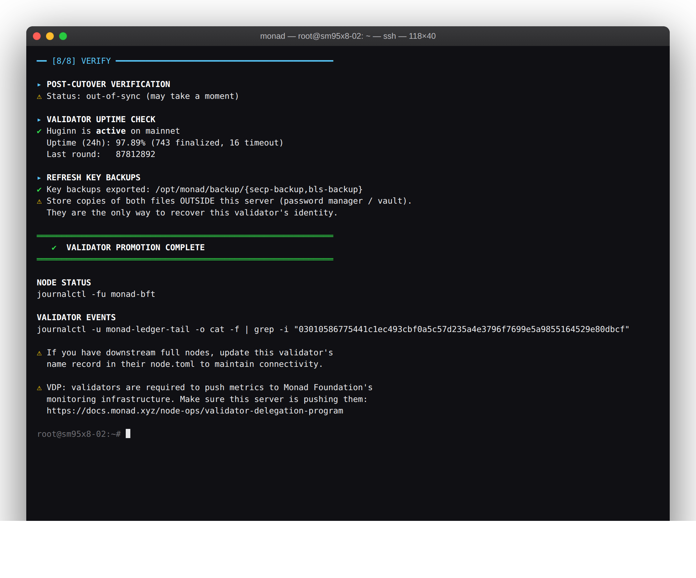

# monad-failover

[](https://github.com/s0urledd/monad-failover-tool/actions/workflows/ci.yml)
[](LICENSE)

Promotes a synced Monad full node to a validator, following the official
[node migration](https://docs.monad.xyz/node-ops/node-recovery/node-migration) procedure.
It is built for the worst case: the old validator server is gone. All it needs is a
synced full node and your `secp-backup` / `bls-backup` key files (created during the
official [full node installation](https://docs.monad.xyz/node-ops/full-node-installation#generate-keystores);
keep copies off-server).

## Install

Pinned to a release tag, so what you download never changes after the fact:

```bash
cd /home/monad
curl -fsSLo monad-failover.sh \
  https://raw.githubusercontent.com/s0urledd/monad-failover-tool/v1.9.0/monad-failover.sh

echo "7e02d451a2007a227afecad06b5bc6602e7fb3f6a2594a2d34bb976efce68235  monad-failover.sh" | sha256sum -c -
chmod +x monad-failover.sh
```

`sha256sum -c` prints `monad-failover.sh: OK` and fails loudly on any mismatch,
so there is nothing to eyeball.

## Usage

On a full node synced to the tip, with your backup files copied over, start with a
dry run. It checks everything and changes nothing:

```bash
./monad-failover.sh --dry-run   # read-only preflight
./monad-failover.sh             # live run
```

| Flag | Effect |
|---|---|
| `--dry-run` | run every preflight check read-only; touch nothing |
| `--backup-dir PATH` | where `secp-backup` / `bls-backup` live; skips the key-source prompt |
| `--public-ip IP` | use this IPv4 in the name record instead of auto-detecting via ifconfig.me |
| `--resume` | pick up where a previous run left off |
| `--version` | print version and exit |

The run is fully interactive and asks for confirmation before anything irreversible.
Keys are read from the backup files by default, or pasted as raw IKM values (hidden
input).

## How it works

1. Verifies the node is in-sync and that you are on the right host, then backs up the
   full node's own identity to `/opt/monad/backup/failover-<timestamp>/`.
2. Imports the validator keys into staging files (`id-secp.new` / `id-bls.new`) and
   shows the recovered public keys for confirmation.
3. Sets `node_name`, `beneficiary` and the required flags, signs a new name record
   with the `self_record_seq_num` you enter (the final value, used verbatim: last
   was 7 → enter 8) — all on a staging copy, `node.toml.new`. **Nothing live changes
   before cutover**: abort at any prompt and the full node is exactly as it was.
4. Asks you to confirm the old validator is stopped (you type `STOPPED`), then cuts
   over: stops services, swaps keys and config into place, restarts as validator,
   and re-exports fresh backup files from the live keys.
5. Verifies the result: every service must actually be **active** after the restart
   (a unit that crashes right after starting fails the run with recovery steps),
   plus local sync status and a query to the [monval](https://monval.huginn.tech/)
   uptime API so you see how the network sees your validator right in the output.

The cutover itself is resumable: before anything moves, the checksums of the staged
files are recorded, so if a rename fails or the machine dies mid-swap, `--resume`
recognizes what already made it into place and finishes only the rest. It never
repeats a completed swap, and once a cutover has begun a fresh run is refused until
the interrupted one is finished. Every live run is also recorded to
`/opt/monad/failover-logs/` (no secrets ever appear in the output), so you always
have a log of what happened.

## Why trust one bash file with your validator keys?

Fair question.

There is nothing to vet beyond the Monad binaries and the tools every Ubuntu server
already ships (bash, curl, systemd, grep/sed/awk/ss). Read it before you run it; it
is short. The README pins its sha256 and CI fails if the two drift apart.

Nothing runs blind. `--dry-run` exercises every check without touching a file, key
or service. CI runs the full promotion flow against mocked Monad binaries with bats,
including cutover failure and resume, plus ShellCheck on every commit.

Nothing sensitive leaves the machine. There is no telemetry. The only outbound calls
are HTTPS requests to `ifconfig.me` for public-IP detection and the monval uptime API
for the post-cutover check, which sends a public key. Secrets are never logged, and
secret files are created `600`. See [SECURITY.md](SECURITY.md) for the full surface.

## Battle-tested

Proven in a live mainnet migration on **Monad v0.14.5** (July 2026): the Huginn
validator was moved to a fresh full node with this script. That run also surfaced
two real signer behaviours which are now fixed and regression-locked in the test
suite. If a future monad release changes the signer's output, the built-in drift
guard stops the run before anything is written.

The full run, phase by phase (the actual mainnet migration, re-rendered in the
current TUI):











## Notes

- Never start the old machine again with the same keys. Two nodes signing with one
  identity is the one mistake you cannot undo, which is why cutover requires you to
  type `STOPPED` after confirming the old validator is down.
- `self_record_seq_num` is monotonic and peers reject stale values. The number you
  enter is used as-is; it lives in your records or on the old validator, not on the
  new machine. If you do not know the last value, enter one you are sure is higher;
  gaps are harmless.
- The VDP requires validators to push metrics to Monad Foundation's monitoring
  infrastructure. Set that up on the new server after migrating
  ([docs](https://docs.monad.xyz/node-ops/validator-delegation-program)).
- If downstream full nodes peer with this validator, update its name record in their
  `node.toml`.

MIT licensed.
