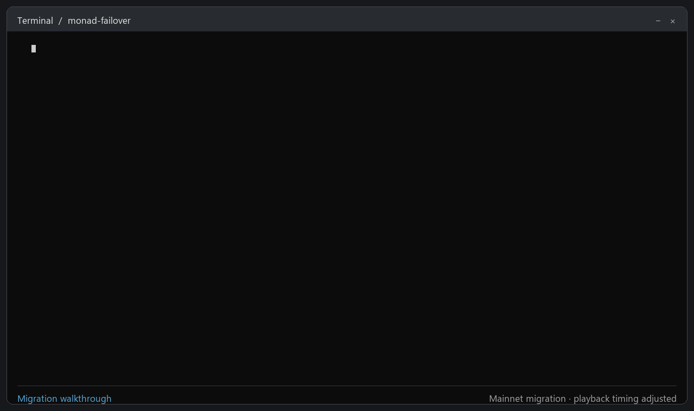
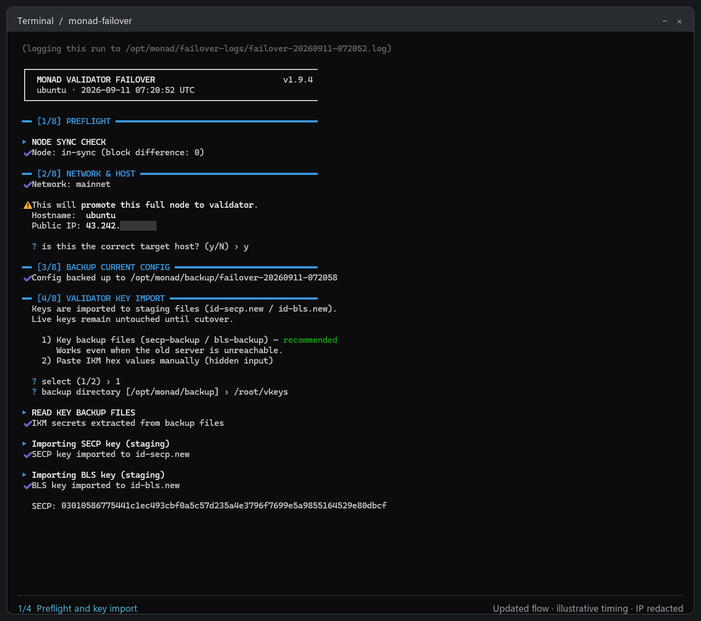
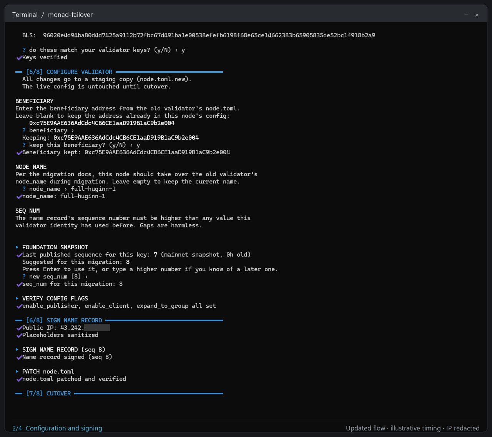
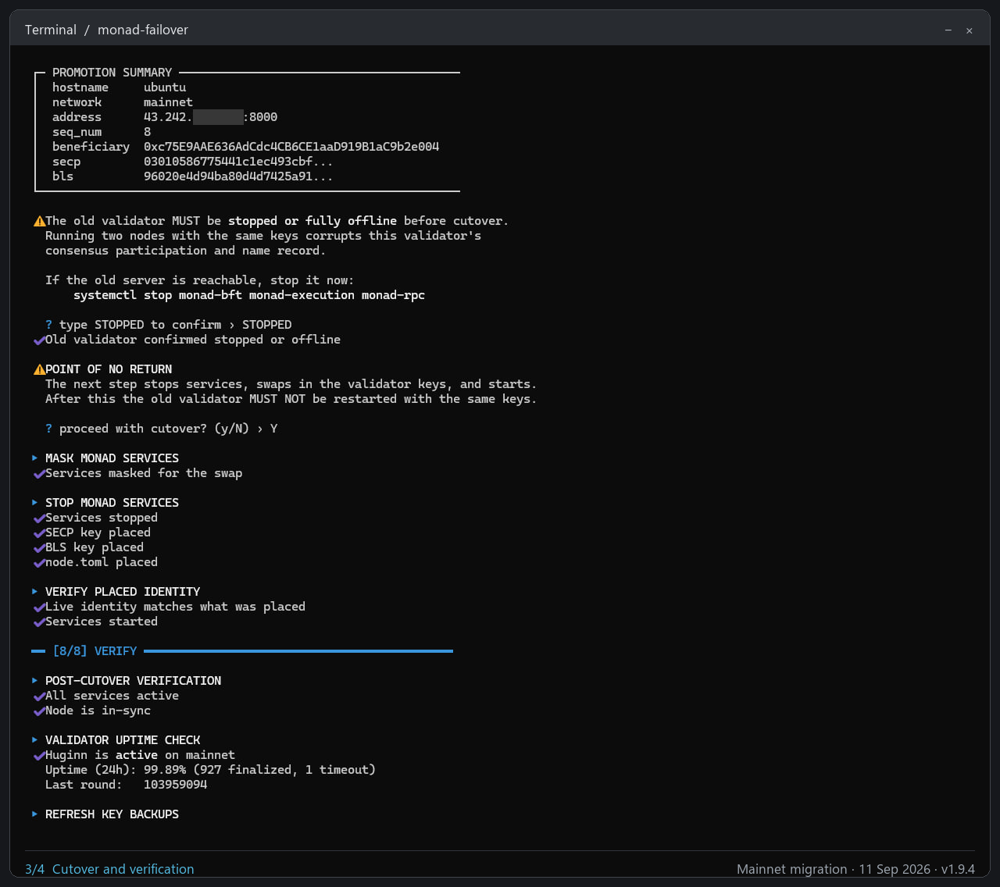
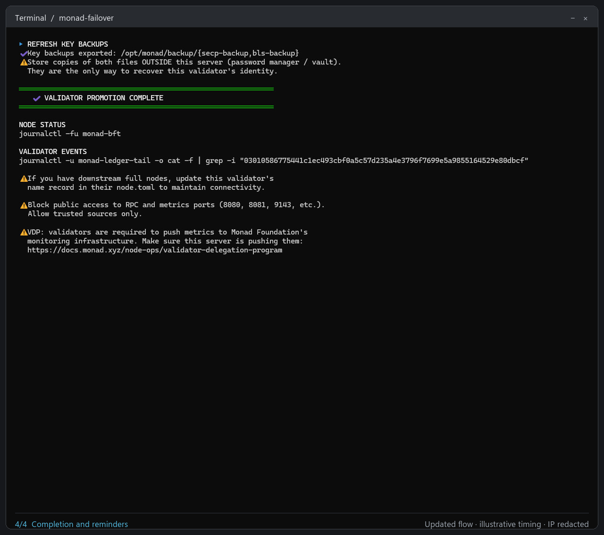

# monad-failover

[](https://github.com/s0urledd/monad-failover-tool/actions/workflows/ci.yml)
[](LICENSE)

Promotes a synced Monad full node to a validator, following the official
[node migration](https://docs.monad.xyz/node-ops/node-recovery/node-migration) procedure.
Use it for a planned migration or recovery when the old server is unavailable.
It runs on the target full node using your validator key backups, with no
connection to the old server required.

## How it works

1. It checks sync and RPC listeners, backs up the full node's identity, and
   prepares the validator keys and signed config in protected staging. You
   confirm the public keys, beneficiary and name record sequence.
2. Once you confirm the old validator is stopped or offline, it masks and stops
   the target services, verifies the staged files, swaps them into place, and
   starts the services with the validator identity.
3. It then checks service health and sync and exports fresh key backups. If sync
   verification is still pending, it says so explicitly.

The tool does not stop the old validator remotely: you stop it yourself, or
ensure it is fully offline, before typing `STOPPED`. Preparation happens before
this gate; the target's running keys and config are replaced only at cutover.

## What you need

- A full node synced to the tip, with its services running.
- The **validator's** `secp-backup` and `bls-backup` files, copied onto this
  server. The full node may have its own files with the same names; select the
  validator's backup directory when prompted. Raw IKM entry is also supported
  with hidden input. Keep backup copies off-server.
- The beneficiary address from the old validator. If you leave it blank the
  tool shows the address already in this node's config and asks you to confirm it.
- The old validator's `node_name`, which the live run asks you to enter.

When a matching record is available in Monad Foundation's validator snapshot,
the tool suggests the next sequence number. Otherwise it asks you to enter one.
Use a number higher than any previously used by this validator identity, even
if that is higher than the snapshot suggestion.

## Install

Run as root on the target full node. The download is pinned to a release tag and
checked before anything is installed:

```bash
curl -fsSLo /usr/local/bin/.monad-failover.new \
  https://raw.githubusercontent.com/s0urledd/monad-failover-tool/v1.9.4/monad-failover.sh &&
echo "aa1d6551f2921cc055d65527644c30d488d43d837080d3ed22904407c499726b  /usr/local/bin/.monad-failover.new" | sha256sum -c - &&
install -m 755 /usr/local/bin/.monad-failover.new /usr/local/bin/monad-failover &&
rm -f /usr/local/bin/.monad-failover.new
```

`sha256sum -c` prints `OK` for the downloaded file and fails loudly on any
mismatch, so there is nothing to eyeball. The download lands next to the
destination rather than on it, so a failed check leaves whatever is already
installed untouched and the chain stops with that step's exit status. `curl`
writing straight to the destination would overwrite it, and keep its mode,
before the check ever runs.

Staging inside `/usr/local/bin` is what keeps this to four plain commands: only
root can write there, whereas a fixed name under `/tmp` would let a local user
redirect the write. It installs there for the same reason, since it runs as
root. After a failed check the staging file stays behind, not executable, if you
want to look at it.

## Run

Start with a dry run. It checks prerequisites without changing the node; it does
not perform a real signing or migration test:

```bash
monad-failover --dry-run   # read-only preflight
monad-failover             # live run
```

| Flag | Effect |
|---|---|
| `--dry-run` | check prerequisites read-only; touch nothing |
| `--backup-dir PATH` | where `secp-backup` / `bls-backup` live; skips the key-source prompt |
| `--public-ip IP` | use this IPv4 in the name record instead of auto-detecting |
| `--resume` | pick up where a previous run left off |
| `--version` | print version and exit |

## Migration walkthrough



From the September 11, 2026 mainnet migration using v1.9.4. This is a sequence
of screenshot excerpts, not a real-time recording; playback timing is illustrative.
The server IP is partially redacted.

<details>
<summary>View all four full-size screenshots</summary>









</details>

## If a run is interrupted

Run `monad-failover --resume` to continue, including after a partial cutover.
The tool refuses a fresh run over an unfinished cutover. The full node's original
identity is backed up under `/opt/monad/backup/failover-<timestamp>/`, and live
runs are logged to `/opt/monad/failover-logs/`.

## Uninstall

After migration and verification are complete, remove the tool with
`sudo rm -- /usr/local/bin/monad-failover`. This leaves Monad, your key backups
and run logs intact; keep the backups for recovery.

## Supported Monad versions

Signer compatibility was checked on a real node running Monad **v0.16.1**, using
a throwaway key. See the [compatibility details](docs/validation.md#signer-compatibility)
for the captured output and scope.

## Verified in practice

The Huginn validator was successfully migrated on **Monad mainnet on September
11, 2026**, using **monad-failover v1.9.4**. The operator reported no missed blocks
during the transition. This is an observation from that migration, not a
zero-downtime guarantee. See [validation details](docs/validation.md) for the
recorded outcome and separate VM reboot tests.

## Notes

- Do not run the old and new machines with the same keys at the same time. Two
  nodes under one identity disrupt this validator's consensus participation and
  name record, which is why cutover makes you type `STOPPED` first.
- The VDP requires validators to push metrics to Monad Foundation's monitoring
  infrastructure. Set that up on the new server after migrating
  ([docs](https://docs.monad.xyz/node-ops/validator-delegation-program)).
- If downstream full nodes peer with this validator, update its name record in
  their `node.toml`. Transfer any custom dedicated-full-node configuration from
  the old validator separately; the tool updates the target's config rather
  than copying the old server's entire `node.toml`.

How the tool protects your keys, what it verifies, and every network call it
makes are documented in [SECURITY.md](SECURITY.md).

MIT licensed.
